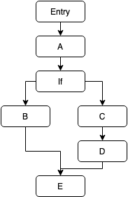
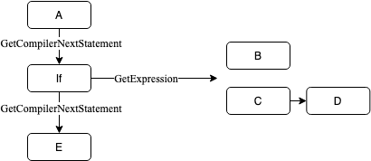

# Flow Nodes (Advanced)

Flow nodes are nodes which are capable of controlling the flow of program, such as choosing one of two branches to execute based on a condition (`if` statement) or repeating a set of nodes a certain number of times (`for` loop). There are very few circumstances where a custom flow node needs to be created for VisualProgrammer, but this article will detail how anyways.

When the VisualProgram compiler is generating the Linq Expression Tree for a program, it makes use of the `GetCompilerNextStatement` method that exists on all `VisualStatement`s. This method is overridable, but has a default implementation that simply returns the _NextStatement_ StatementReference that also exists on all statements. When the compiler generates the expression tree for a particular entry, it will create a Block Linq expression and populate it with the expression generated by the first statement, then the next compiler statement from that statement, then the next compiler statement etc.

This default behaviour works fine for a simple program with only one branch, however when it encounters an _If_ node, it shouldn't put all the true statements and all the false statements in the block because this will mean **everything** runs. To resolve this, the _If_ node overrides the default behaviour of the `GetCompilerNextStatement`.

When designing the if statement, I wanted to make it as simple as possible. So, ideally I wanted to get rid of the "Next statement" reference so that less-experienced users do not struggle to understand which statement connector they need to join their nodes to. By reducing it to just "True" and "False" connectors, users can more easily see which branch does what, and then when they need to, they can just connect to two separate branches back together.

This means that to implement the `GetCompilerNextStatement`, the node needs to return the first common statement between both the branches. The node's generated expression needs to be a Linq `IfThenElse` expression, which needs to have all the statements unqiue to either branch.

As a basic example, imagine the program had the structure as shown on the image below on the left. The 'If' node needs to be able to convert this structure to the corresponding approximate expression tree shown below on the right.




There are some helper methods that have been added to the `NodeUtils` class to help with achieving this. `NodeUtils.FlattenExpressions` takes a context and two statement references and creates a collection of Linq expressions (that can be added into a Linq Block expression) for all nodes up to the first common shared node between them. Additionally, there is a `NodeUtils.FindNextSharedNode` method which takes a context and two statement references and returns the first statement that is common to both branches. Note that these methods use `GetNextCompilerStatement` so nesting If statements works as expected. Using these two methods, the If statement can be implemented correctly. Below is that implementation (commented):

```cs
public sealed class If : VisualStatement {

	// This is our expression that will be evaluated to determine which branch gets executed
	[VisualNodeProperty] public ExpressionReference<bool> Condition { get; set; }

	// These two references allow the user to connect the if node to other statements
	[VisualNodeProperty] public StatementReference TrueBranch { get; set; }
	[VisualNodeProperty] public StatementReference FalseBranch { get; set; }

	public override Expression CreateExpression(VisualProgram context) {
		// Get a tuple that contains two IEnumerable<System.Linq.Expression> that have the expressions that are unique to each branch.
		// If this was called on the above example structure, the `branch1Flattened` value on the tuple would contain the "B" statement
		// and the `branch2Flattened` value would contain the "C" and "D" statements.
		var branches = NodeUtils.FlattenExpressions(context, TrueBranch, FalseBranch);

		// Create an IfThenElse expression which first requires the condition expression (i.e. true/false)
		// Then also provide it with two blocks that contain the flattened statements
		return Expression.IfThenElse(
			Condition.ResolveRequiredExpression(context),
			Expression.Block(branches.branch1Flattened),
			Expression.Block(branches.branch2Flattened)
		);
	}

	// The next compiler statement is the first statement that is common between both branches.
	// If this was run on the example structure above, this would get the statement reference for "E" statement.
	public override StatementReference? GetCompilerNextStatement(VisualProgram context) => NodeUtils.FindNextSharedNode(context, TrueBranch, FalseBranch);

	// We override the NextStatement property which means that the [VisualNodeProperty] attribute is no longer applied (since that attribute is not inherited)
	// This causes the "NextStatement" to be hidden on the node, preventing users from connecting to it
	public override StatementReference NextStatement { get => default; set { } }
}
```