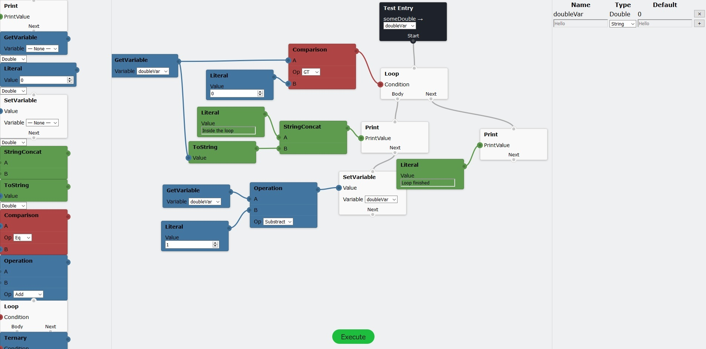

# VisualProgrammer.Blazor

*A Blazor UI library for VisualProgrammer.Core*

## Overview

This library exposes some components for use Blazor that allows the user to edit a VisualProgram using a drag-and-drop interface.

Nodes can be dragged from the toolbox on the left-hand side onto the central area, the "canvas". From there, the user can drag the nodes around or connect up the links between nodes. Each node and node connector (the circles that appear on the edge of the nodes themselves) is coloured according to the type of data it evaluates to or accepts as a parameter. The column on the right-hand side allows the user to edit the variables registered in the program.

View the documentation for VisualProgrammer [here](https://wibble199.github.io/VisualProgrammer/doc/).
